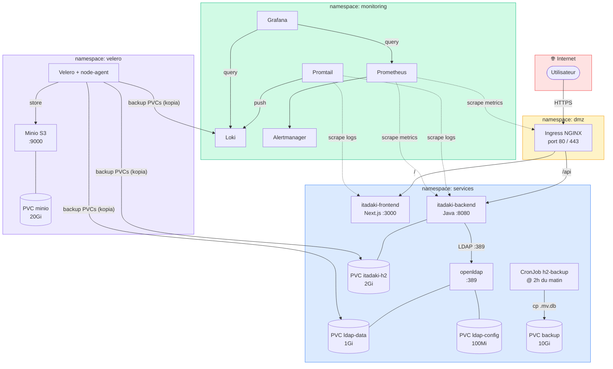

# Architecture — ACME Corp Hackathon (Itadaki)

## Stack déployée

| Couche | Technologie | Namespace |
|--------|-------------|-----------|
| Ingress | NGINX (via terraform-kube) | dmz |
| Frontend | Next.js :3000 | services |
| Backend | Java Spring Boot :8080 | services |
| Base de données | H2 (fichier persistant sur PVC) | services |
| Annuaire | OpenLDAP :389 (StatefulSet) | services |
| Logs | Loki + Promtail | monitoring |
| Métriques | Prometheus + Grafana + Alertmanager (via terraform-kube) | monitoring |
| Backup K8s | Velero + Minio S3 | velero |
| Réseau secondaire | Multus (macvlan sur eth0) | cluster-wide |

## Schéma

## NetworkPolicies

| Règle | Source | Destination | Port |
|-------|--------|-------------|------|
| allow-internet-to-ingress | 0.0.0.0/0 | ingress-nginx (dmz) | 80, 443 |
| allow-dmz-to-itadaki | dmz | itadaki-frontend | 3000 |
| allow-dmz-to-itadaki | dmz | itadaki-backend | 8080 |
| allow-frontend-to-backend | itadaki-frontend | itadaki-backend | 8080 |
| allow-backend-to-ldap | itadaki-backend | openldap | 389 |
| allow-monitoring-scrape | monitoring | dmz + services | 9090, 9100, 8080 |
| default-deny | — | dmz, services, monitoring | tout bloqué par défaut |

## Persistance des données

| Donnée | PVC | Taille | Survit à la suppression |
|--------|-----|--------|------------------------|
| H2 (Itadaki) | `itadaki-h2-pvc` | 2Gi | Oui |
| LDAP data | `ldap-data-openldap-0` | 1Gi | Oui |
| LDAP config | `ldap-config-openldap-0` | 100Mi | Oui |
| Backup H2 | `backup-pvc` | 10Gi | Oui |
| Loki logs | PVC Helm loki-stack | 5Gi | Oui |
| Minio (Velero) | `minio-pvc` | 20Gi | Oui |
