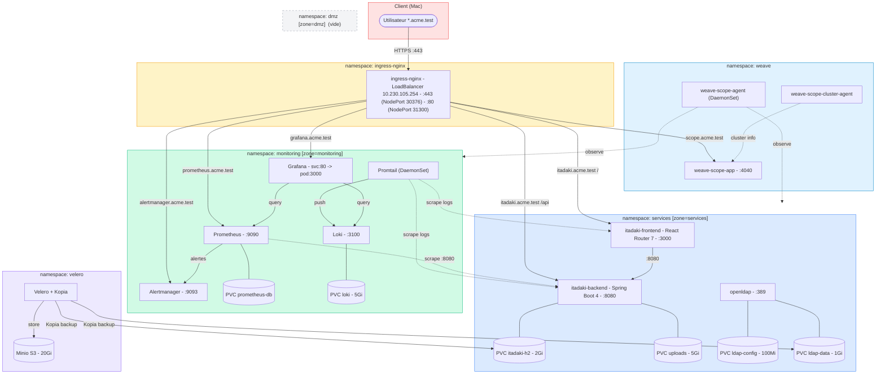
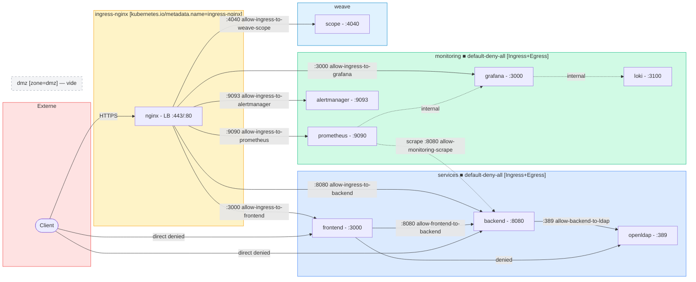

# Architecture — ACME Corp Hackathon (Itadaki)

## Stack déployée

| Couche | Technologie | Namespace |
|--------|-------------|-----------|
| CNI | Flannel (K3s défaut) | cluster-wide |
| Réseau secondaire | Multus (macvlan) | cluster-wide |
| Visualisation réseau | Weave Scope :4040 (app + agent + cluster-agent) | weave |
| Ingress controller | ingress-nginx (LoadBalancer via K3s ServiceLB) | ingress-nginx |
| TLS | cert-manager + ca-issuer (self-signed CA) | cert-manager |
| Frontend | React Router 7 (SSR, Bun) :3000 | services |
| Backend | Java Spring Boot 4 + H2 :8080 | services |
| Base de données | H2 fichier persistant sur PVC (2Gi) | services |
| Uploads | PVC 5Gi (images food) | services |
| Annuaire | OpenLDAP :389 (StatefulSet) | services |
| Logs | Loki + Promtail | monitoring |
| Métriques | Prometheus + Grafana + Alertmanager | monitoring |
| Backup K8s | Velero + Kopia + Minio S3 (20Gi) | velero |

## URLs exposées via Ingress

| Service | URL | Port pod |
|---------|-----|---------|
| Itadaki (app) | `https://itadaki.acme.test` | frontend:3000 / backend:8080 |
| Grafana | `https://grafana.acme.test` | :3000 (svc :80) |
| Prometheus | `https://prometheus.acme.test` | :9090 |
| Alertmanager | `https://alertmanager.acme.test` | :9093 |
| Weave Scope | `https://scope.acme.test` | :4040 |

> DNS : entrées dans `/etc/hosts` → `10.230.105.254` (`make hosts`)
> Ingress-nginx : LoadBalancer `10.230.105.254:443` (NodePort 30376) / `:80` (NodePort 31300)

## Schéma d'architecture général

## Flux réseau & NetworkPolicies

## NetworkPolicies (état cluster)

| Namespace | Règle | Type | Source | Destination | Port |
|-----------|-------|------|--------|-------------|------|
| dmz | allow-internet-to-ingress | Ingress | 0.0.0.0/0 | ingress-nginx pods | 80, 443 |
| dmz | allow-monitoring-scrape-dmz | Ingress | zone=monitoring | (all) | 8080, 9090, 9100 |
| dmz | default-deny-all | Ingress+Egress | — | — | — |
| monitoring | allow-ingress-to-grafana | Ingress | ingress-nginx ns | grafana | 3000 |
| monitoring | allow-ingress-to-prometheus | Ingress | ingress-nginx ns | prometheus | 9090 |
| monitoring | allow-ingress-to-alertmanager | Ingress | ingress-nginx ns | alertmanager | 9093 |
| monitoring | allow-monitoring-internal | Ingress+Egress | pods within ns | pods within ns | all |
| monitoring | allow-monitoring-egress | Egress | (all) | zone=dmz, zone=services | 8080, 9090, 9100 |
| monitoring | default-deny-all | Ingress+Egress | — | — | — |
| services | allow-ingress-to-frontend | Ingress | ingress-nginx ns | itadaki-frontend | 3000 |
| services | allow-ingress-to-backend | Ingress | ingress-nginx ns | itadaki-backend | 8080 |
| services | allow-dmz-to-itadaki-frontend | Ingress | zone=dmz ns | itadaki-frontend | 3000 |
| services | allow-dmz-to-itadaki-backend | Ingress | zone=dmz ns | itadaki-backend | 8080 |
| services | allow-frontend-to-backend-egress | Egress | itadaki-frontend | itadaki-backend | 8080 |
| services | allow-frontend-to-backend-ingress | Ingress | itadaki-frontend | itadaki-backend | 8080 |
| services | allow-backend-to-ldap-egress | Egress | itadaki-backend | openldap | 389 |
| services | allow-backend-to-ldap-ingress | Ingress | itadaki-backend | openldap | 389 |
| services | allow-monitoring-scrape-services | Ingress | zone=monitoring | (all) | 8080, 9090, 9100 |
| services | default-deny-all | Ingress+Egress | — | — | — |
| weave | allow-ingress-to-weave-scope | Ingress | ingress-nginx ns | weave-scope-app | 4040 |

## Persistance des données (PVCs actifs)

| Donnée | PVC | Taille | Namespace |
|--------|-----|--------|-----------|
| H2 (Itadaki DB) | `itadaki-h2-pvc` | 2Gi | services |
| Uploads (images) | `itadaki-uploads-pvc` | 5Gi | services |
| LDAP data | `ldap-data-openldap-0` | 1Gi | services |
| LDAP config | `ldap-config-openldap-0` | 100Mi | services |
| Prometheus | `prometheus-db-prometheus-...` | auto | monitoring |
| Loki logs | `storage-loki-stack-0` | 5Gi | monitoring |
| Minio (Velero S3) | `minio-pvc` | 20Gi | velero |

> Backup : Velero + Kopia sauvegarde automatiquement les namespaces `services` et `monitoring` vers Minio.
